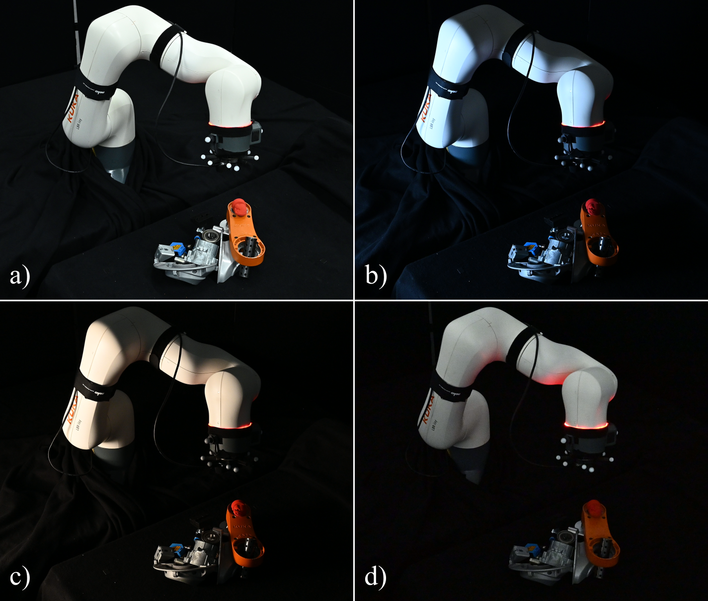
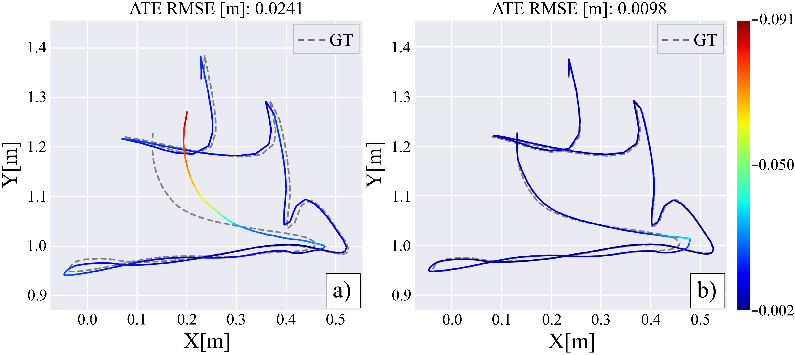
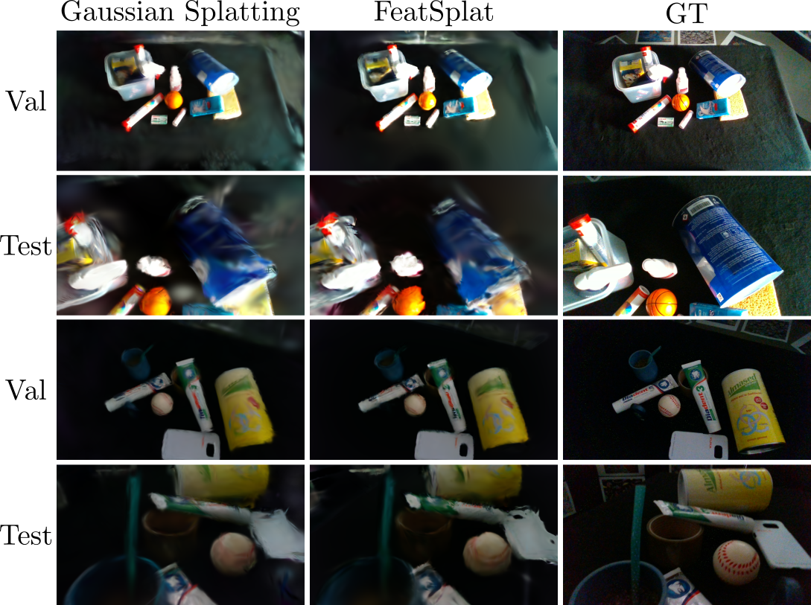

<p align="center">
  <h1 align="center">SLAM&Render: A Benchmark for the Intersection Between Neural Rendering, Gaussian Splatting and SLAM</h1>
  <p align="center">
    <a><strong>Samuel Cerezo</strong></a> ·
    <a><strong>Gaetano Meli</strong></a> ·
    <a><strong>Tomas Berriel Martins</strong></a> ·
    <a><strong>Kirill Safronov</strong></a> ·
    <a><strong>Javier Civera</strong></a>
  </p>
  <h3 align="center">2025</h3>
  <p align="center"><a>Paper</a> | <a>Video</a> | <a href="https://samuel-cerezo.github.io/SLAM&Render.html">Project Page</a></p>
</p>

<p align="center">
  
</p>

---

### 🎬 SLAM&Render: Video Overview

Explore the **SLAM&Render** dataset with this short video showcasing the five key sequences included in the project. Click below to watch the video!

[](https://www.youtube.com/watch?v=_s-tQMSZHXU)

> Watch the full introduction to the **SLAM&Render** dataset and see how the dataset integrates neural rendering, Gaussian splatting, and SLAM in action.

---

## 📌 **Overview**

🚨 **Current Datasets' Limitations:**
Existing datasets fail to address critical challenges in the following fields:

- 🧩 **Multi-modality** and **Sequentiality** in **SLAM**.
- 🌍 **Generalization across Viewpoints** and **Lighting Conditions** in **Neural Rendering**.

---

✨ **Introducing SLAM&Render**:
A novel dataset designed to explore the intersection of both **SLAM** and **Neural Rendering**, covering:

- 📊 **40 Real-World Sequences**.
- 🔄 Synchronized **RGB**, **Depth**, **IMU**, **Robot Kinematics**, and **Ground-Truth Poses**.

---

## 📁 Dataset Structure

Each sequence contains:

```
sequence_name/
├── rgb/                          # RGB images (30 Hz)
├── depth/                        # Aligned depth images
├── robot_data/joint_states.txt   # Robot joint encoders (25 Hz)
├── robot_data/flange_poses.txt   # Forward kinematics pose (25 Hz)
├── associations.txt              # Association between images
├── imu.txt                       # Accelerometer + gyroscope (210 Hz)
├── groundtruth_raw.csv           # Raw MoCap ground truth (120 Hz)
├── groundtruth.txt               # MoCap ground truth with Unix epoch timestamp(120 Hz)
```

> See [`data/README.md`](data/README.md) for full details.

---

## 🚀 Getting Started

```bash
git clone https://github.com/samuel-cerezo/slam-render.git
cd slam-render
pip install -r requirements.txt
```

To download a sequence:

```bash
python scripts/download_data.py --sequence 4-natural-train
```

---

## 🛠️ Examples & Tools

We provide utility scripts to align and use the dataset easily:

| Script | Description |
|--------|-------------|
| `scripts/temporal_align.py` | Align timestamps between camera and gt data. |
| `scripts/fFlange2world.py` | Align poses to a world frame using motion capture. |
| `scripts/ROSBAG2TUM.py` | Convert .bag file into a TUM format. |
| `scripts/reading_mocap_CSV.py` | Convert mocap raw data into a txt with the corresponding unix epoc timestamp. |
| `scripts/download_data.py` | For downloading dataset sequences |
| `slamrender/alignment_utils.py` | Core functions for spatial and temporal alignment. |

> See the notebook [`notebooks/example_usage.ipynb`](notebooks/example_usage.ipynb) for a full pipeline.

---

## 🧪📊 Evaluation

In this section, we provide the evaluation results of the SLAM&Render dataset. The following figures show the key metrics for evaluating the performance of models trained on this dataset:

1. **RMSE ATE Evaluation**
The following figure illustrates the RMSE ATE results obtained for setup-4 under cold conditions. 
The trajectory result using MonoGS is shown in a). Similarly when kinematic data as initial seed is used, the result is shown in b).

<p align="center">
  
</p>

2. **Novel View Synthesis Evaluation**

We also assess the performance of NVS on the dataset. To highlight the usefulness of the
independent test camera trajectories, we evaluated the performance of two state-of-the-art baselines: Gaussian Splatting; and FeatSplat. The following image compares the rendered output to the ground truth.

<p align="center">
  
</p>

---

## 🤝 Acknowledgements

This work includes many open-source projects:
- MonoGS

---

## 📄 License

Released under the [LICENSE.md](LICENSE.md).

---

## 📚 Citation

If you find this dataset useful, please cite us:

```bibtex
@misc{slamrender2025,
  title={SLAM\&Render: A Benchmark for the Intersection Between Neural Rendering and SLAM},
  author={Samuel Cerezo and Gaetano Meli and Tomas Berriel Martins and Kirill Safronov and Javier Civera},
  year={2025},
}
```

---

## 🌐 Links

- 📄 [Project Page](https://samuel-cerezo.github.io/SLAM&Render)
---


