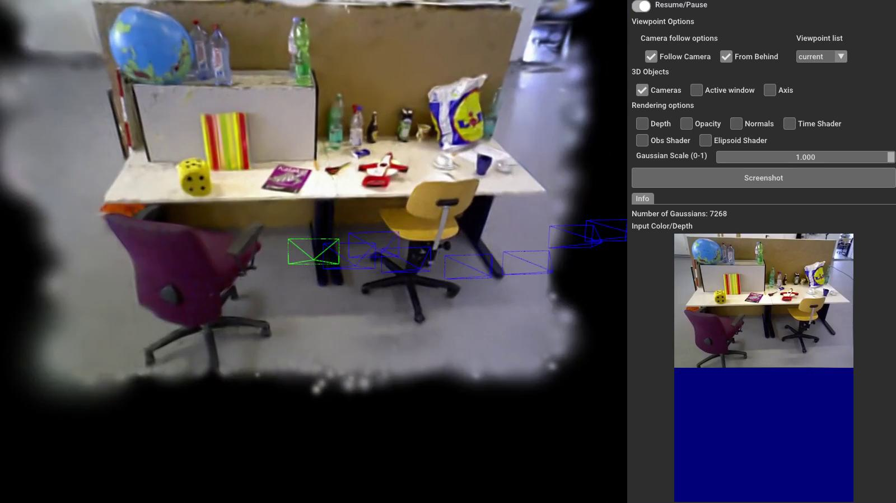

[comment]: <>

<!-- PROJECT LOGO -->

  <h1 align="center"> SLAM&Render: A Benchmark for the Intersection Between Neural
Rendering, Gaussian Splatting and SLAM
  </h1>
  

    <a href="https://samuel-cerezo.github.io/"><strong>Samuel Cerezo</strong></a>
    ·
    <a href="https://samuel-cerezo.github.io/"><strong>Samuel Cerezo</strong></a>
    ·
    <a href="https://samuel-cerezo.github.io/"><strong>Samuel Cerezo</strong></a>
    ·
    <a href="https://samuel-cerezo.github.io/"><strong>Samuel Cerezo</strong></a>
    
  

  <h3 align="center"> 2025 (Under revision)</h3>

[comment]: <> (  <h2 align="center">PAPER</h2>)
  <h3 align="center"><a href="https://samuel-cerezo.github.io/">Paper</a> | <a href="https://samuel-cerezo.github.io/">Video</a> | <a href="https://samuel-cerezo.github.io/">Project Page</a></h3>
  

  
  

we introduce SLAM&Render, a novel dataset designed to explore the intersection of both domains. It comprises 40 sequences with synchronized RGB, depth, IMU, robot encoder data, and ground truth pose streams.

 

# Note
- Note 1
- Note 2

# Getting Started

# Evaluation
-

# Acknowledgement
This work incorporates many open-source codes...

# License
SLAM&Render is released under a **LICENSE.md**. For a list of code dependencies which are not property of the authors of MonoGS, please check **Dependencies.md**.

# Citation
If you found this code/work to be useful in your own research, please considering citing the following:

